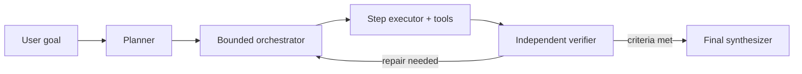

# Agentic Problem Solver

A small, reusable **plan → execute → verify → replan → synthesize** framework built from the patterns in Microsoft's [Agent Framework Samples](https://github.com/microsoft/Agent-Framework-Samples). It uses structured Pydantic outputs, explicit dependencies, evidence-aware review, and hard execution limits. It runs against a local open-source model served through vLLM—no paid model API is required.

## Architecture



The orchestration loop is deterministic Python. Models propose typed artifacts; code validates dependencies, bounds work, and controls transitions. This makes tool permissions, human approval, persistence, tracing, and domain-specific agents straightforward additions.

## Run

Requires Python 3.10+, an NVIDIA GPU supported by vLLM, and a local model checkpoint.

```bash
python -m venv .venv
# Windows: .venv\Scripts\activate
# macOS/Linux: source .venv/bin/activate
pip install -e ".[dev]"
copy .env.example .env  # use cp on macOS/Linux
```

In a separate terminal, start a local OpenAI-compatible vLLM server (pick a model that fits your GPU):

```bash
pip install vllm
vllm serve Qwen/Qwen2.5-7B-Instruct --dtype auto --api-key local-dev-key
```

Then run the agent:

```bash
solve "Create a migration plan from a monolith to services with rollback criteria"
pytest
```

The default `.env` points to `http://localhost:8000/v1`. Change `VLLM_MODEL` to exactly the model ID served by vLLM, and use the same value for `VLLM_API_KEY` as the server's `--api-key`. vLLM exposes the OpenAI-style Chat Completions API and supports JSON structured output, which this framework uses for plans and reviews. See the [vLLM OpenAI-compatible server documentation](https://docs.vllm.ai/en/latest/serving/online_serving/openai_compatible_server/).

## Extension points

- Implement `SolverBackend` for Azure OpenAI, Microsoft Foundry, local models, or test doubles.
- Give the solver agent approved functions/MCP tools when constructing it; keep high-impact tools behind explicit approval.
- Replace sequential execution with a `WorkflowBuilder` graph for independent steps that can safely run concurrently.
- Persist `Plan`, `StepResult`, and `Review` after every transition for resumability and audit.
- Emit OpenTelemetry spans around `plan`, each `execute`, `review`, and `synthesize` call.

## Production guardrails

Treat model output as untrusted. Validate tool arguments, scope credentials per tool, enforce time/cost/step limits, redact secrets, require evidence for claims, and use human approval for irreversible actions. The included loop intentionally stops at `MAX_STEPS` and `MAX_REPLANS`.
