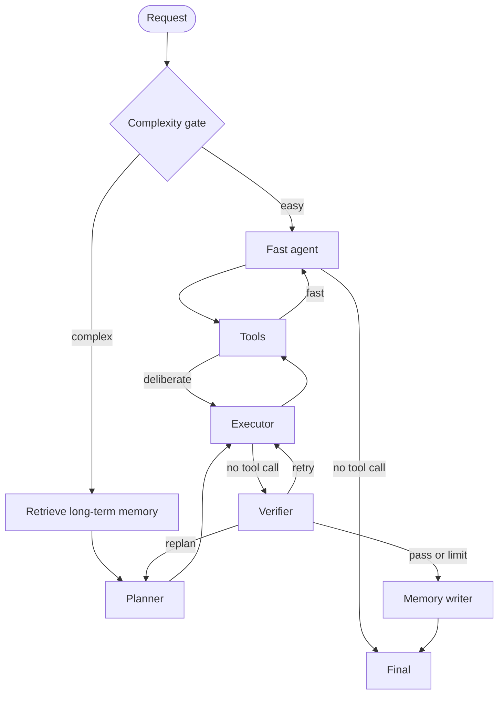

# Adaptive LangGraph Agent

A reusable LangGraph starter with two execution modes and two separate kinds of memory:

- **Fast path:** one model/tool loop for easy requests; no planner or verifier overhead.
- **Deliberate path:** retrieve memory → planner agent → executor agent/tools → verifier agent → retry/replan (bounded).
- **Short-term memory:** graph state persisted per `thread_id` by `SqliteSaver` in `checkpoints.sqlite`.
- **Long-term memory:** verified, reusable facts persisted across threads in a physically separate `long_term_memory.sqlite`, scoped by `user_id`.

This follows LangGraph's distinction between checkpointed thread state and cross-thread stores, while keeping a small local SQLite implementation that is easy to understand and replace.

## Run

```powershell
python -m venv .venv
.venv\Scripts\Activate.ps1
pip install -e ".[dev]"
Copy-Item .env.example .env
# edit .env and set OPENAI_API_KEY
adaptive-agent --user alice --thread task-001 "Summarize 12 * 18 in one sentence"
```

Continue the same short-term conversation by reusing `--thread`. Start another thread with the same `--user` to reuse long-term memory.

## Architecture



## Add tools

Create an ordinary LangChain `@tool`, then pass it to `build_agent(extra_tools=[my_tool])`. Tools automatically become available to both paths. The included tools are web search, safe arithmetic, current UTC time, workspace file listing/reading, and HTTP GET. In production, apply authentication and per-tool authorization, and swap local SQLite for Postgres/Redis as appropriate.

## Agent responsibilities

- `PlannerAgent` reads the task, relevant long-term memories, verified facts, failures, and verifier feedback. It returns at most five steps and cannot call tools.
- `ExecutorAgent` receives the plan and shared working state. It selects tools and produces a candidate answer.
- `VerifierAgent` independently returns `pass`, `retry`, or `replan`, plus verified facts and actionable feedback.
- `MemoryCurator` runs only after verification passes. It is the sole component that can promote facts into long-term memory.
- `FastAgent` bypasses the other roles for easy tasks, but can still use tools.

Each role may use a different model through `PLANNER_MODEL`, `EXECUTOR_MODEL`, and `VERIFIER_MODEL`; unset values fall back to `AGENT_MODEL`.

The complexity gate is deliberately deterministic: short conversational, arithmetic, rewriting, and simple lookup requests avoid an extra classification model call. Requests with multiple steps, research/comparison language, coding/debugging, or explicit planning go to the bounded deliberate workflow. Override it per request with `force_mode="fast"` or `force_mode="deliberate"`.

## Library usage

```python
from adaptive_agent import AgentContext, build_agent

with build_agent() as agent:
    result = agent.invoke(
        "Compare SQLite and Postgres for agent memory and recommend one.",
        context=AgentContext(user_id="alice"),
        thread_id="architecture-1",
    )
    print(result["final_answer"])
```

## Production notes

- Treat long-term memory writes as untrusted data; the writer only runs after verification and stores compact facts, but applications should add retention/deletion policies.
- `fetch_url` blocks localhost/private-network hosts to reduce SSRF risk. Use a dedicated search provider for real web research.
- Keep iteration limits low. More looping does not guarantee a better answer.
- Replace the heuristic router or verifier independently if your domain needs stricter behavior.
