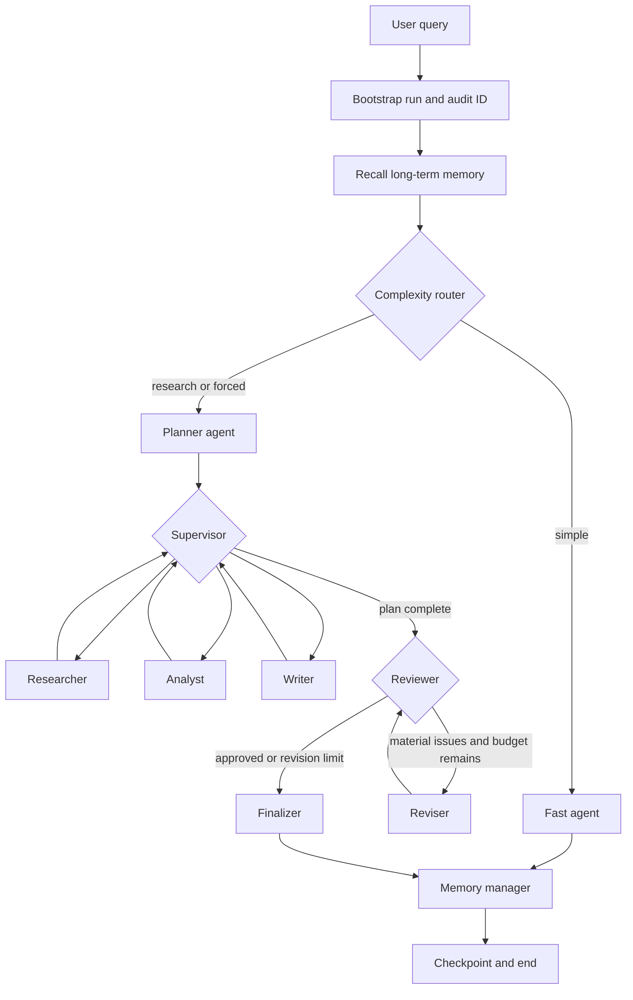

# Architecture

## Runtime graph

## Collaboration contract

Agents do not communicate through hidden global variables. The LangGraph state is their shared contract:

- `plan`: the planner's typed task list.
- `task_results`: append-only specialist handoffs available to later agents.
- `draft`: the current writer/reviser product.
- `review`: the reviewer's typed decision and missing items.
- `messages`: checkpointed user/assistant chat history.
- `memories`: retrieved long-term user context.

The supervisor derives the next task from `len(task_results)`, which makes progress inspectable and resumable. Tool loops and revision loops have independent hard limits.

## Memory layers

| Layer | Scope | Storage | Purpose |
|---|---|---|---|
| Working | One graph run | LangGraph state | Plan, evidence, calculations, draft, review |
| Short-term | User + thread | SQLite checkpointer | Chat history and resumable state |
| Long-term | User | SQLite FTS5 | Stable profile facts, preferences, goals, constraints |
| Audit | Run ID | SQLite | Research analysis, debugging, reproducibility |

For a multi-process deployment, replace the SQLite checkpointer and stores with Postgres. For semantic memory, preserve the `LongTermMemory` interface and add embeddings/vector retrieval.

## Model assignment

One model can run all roles. Optional environment variables assign different models to planner, researcher, analyst, writer, and reviewer while retaining a shared OpenAI-compatible endpoint.

## Tool security

Tools are role-scoped. File paths are confined to `WORKSPACE_DIR`; the URL fetcher blocks private and loopback IP addresses; arithmetic uses an AST allowlist. Add authentication, rate limits, sandboxing, and human approval for production integrations.

