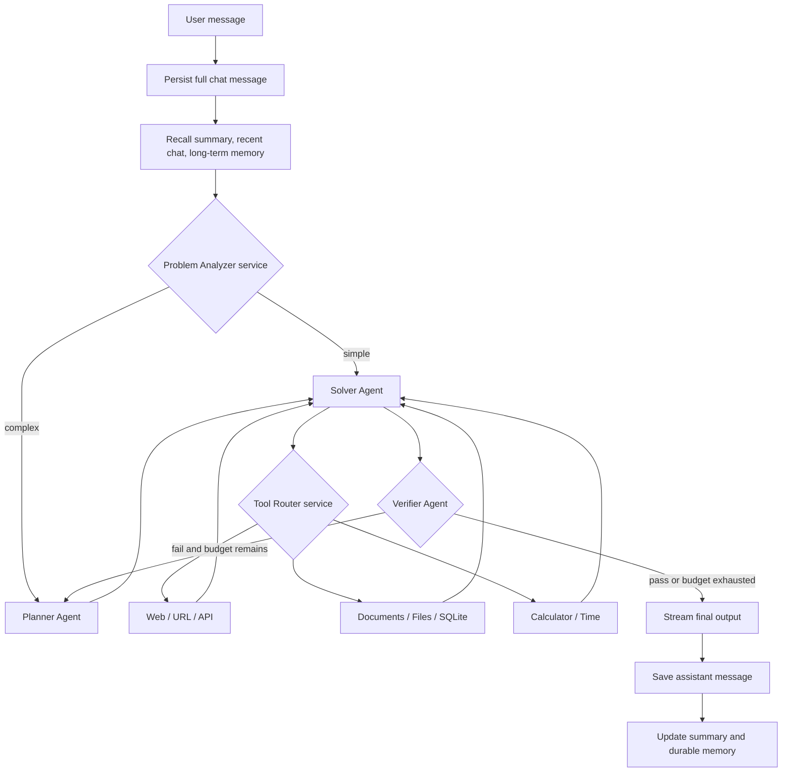

# Architecture



## Storage separation

| Concern | File | Retention |
|---|---|---|
| Complete transcripts and conversation metadata | `.data/chat_history.sqlite` | Until the conversation is deleted |
| LangGraph resumable state | `.data/langgraph_checkpoints.sqlite` | Per user/thread checkpoint |
| Long-term user memory | `.data/long_term_memory.sqlite` | Until memory is deleted |
| Runs and stage/tool events | `.data/audit.sqlite` | Append-only audit trail |
| Portable result documents | `.data/results/RUN_ID.json` | One file per successful or failed run |

The full transcript is never discarded when the model context is shortened. Models receive the rolling summary, recent conversation, relevant durable memories, and current working state.

## Collaboration contract

The three agents collaborate through typed LangGraph state:

```text
query
conversation_summary
recalled_memories
plan
step_results
tool_observations
candidate_answer
verification
replan_count
final_answer
```

The Verifier's structured feedback is returned to the Planner. The Planner sees previous step results and creates a correction plan. Hard limits prevent endless loops.

## Model compatibility

`ChatOpenAI` is used as an OpenAI-protocol client. With no base URL it connects to official OpenAI. With a base URL it connects to vLLM, LM Studio, Ollama's compatible endpoint, or another provider implementing the OpenAI chat-completions and tool-calling protocol.

Role-specific model IDs let a small model plan, a tool-capable model solve, and a stronger model verify.

## Scaling

SQLite is appropriate for a local PyCharm process. For multiple application processes, retain the repository interfaces and migrate conversations/checkpoints/audit data to PostgreSQL. Add `pgvector` or another vector backend when semantic retrieval is required.

